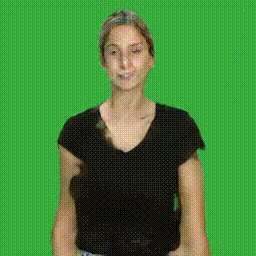
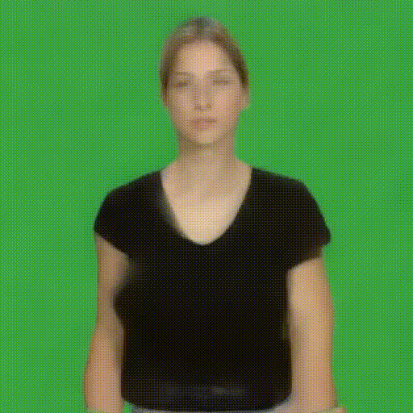
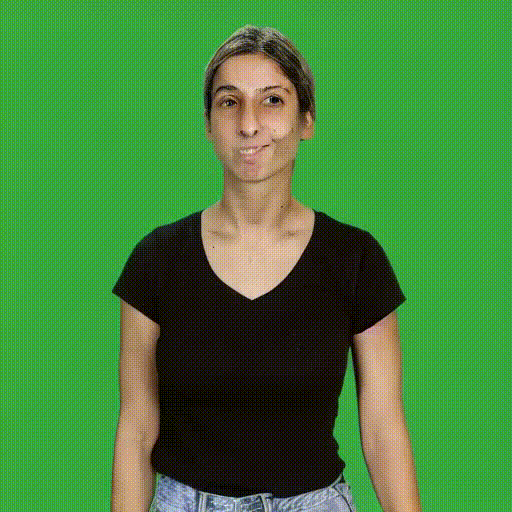
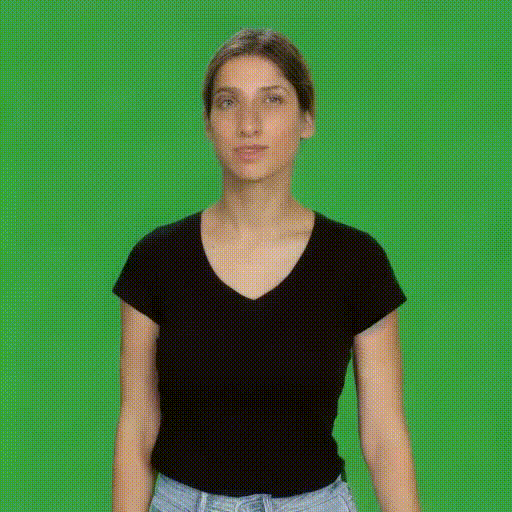

# Pose-to-Video

## Examples

|            | Original                                           | Upscaled                                                 | AnimateDiff                                                    | AnimateDiff + Upscaled                                                        |
|------------|----------------------------------------------------|----------------------------------------------------------|----------------------------------------------------------------|-------------------------------------------------------------------------------|
| Pix2Pix    | 256x256     | 768x768  | 512x512  | 768x768     |
| ControlNet | 512x512  | n/a                                                      | 512x512       | 768x768  |

## Usage

To animate a `.pose` file into a video, run

```bash
pip install '.[pix2pix]'
wget "https://firebasestorage.googleapis.com/v0/b/sign-mt-assets/o/models%2Fgenerator%2Fmodel.h5?alt=media" -O pix_to_pix.h5
pose_to_video --type=pix2pix --model=pix_to_pix.h5 --pose=assets/testing-reduced.pose --video=assets/outputs/pix2pix.mp4
# Or including upscaling
pip install '.[pix2pix,simple_upscaler]'
pose_to_video --type=pix2pix --model=pix_to_pix.h5 --pose=assets/testing-reduced.pose --video=assets/outputs/pix2pix-upscaled.mp4 --processors simple_upscaler
# Or including AnimateDiff
pip install '.[pix2pix,animatediff]'
pose_to_video --type=pix2pix --model=pix_to_pix.h5 --pose=assets/testing-reduced.pose --video=assets/outputs/pix2pix-animatediff.mp4 --processors animatediff
# Or including both!
pip install '.[pix2pix,simple_upscaler,animatediff]'
pose_to_video --type=pix2pix --model=pix_to_pix.h5 --pose=assets/testing-reduced.pose --video=assets/outputs/pix2pix-upscaled-animatediff.mp4 --processors simple_upscaler animatediff simple_upscaler
```

Using ControlNet:

```bash
pip install '.[controlnet]'
pose_to_video --type=controlnet --model=sign/sd-controlnet-mediapipe --pose=assets/testing-reduced.pose --video=assets/outputs/controlnet.mp4
# Or including AnimateDiff (Requiring more VRAM):
pip install '.[controlnet,animatediff]'
pose_to_video --type=controlnet --model=sign/sd-controlnet-mediapipe --pose=original.pose --video=original-cn.mp4
pose_to_video --type=controlnet --model=sign/sd-controlnet-mediapipe --pose=maayan.pose --video=maayan-cn.mp4
pose_to_video --type=controlnet --model=sign/sd-controlnet-mediapipe --pose=maayan.pose --video=maayan-cnad.mp4 --processors animatediff
pose_to_video --type=controlnet --model=sign/sd-controlnet-mediapipe --pose=original.pose --video=original-cnad.mp4 --processors animatediff
# Or also upscaling
pip install '.[controlnet,animatediff,simple_upscaler]'
pose_to_video --type=controlnet --model=sign/sd-controlnet-mediapipe --pose=assets/testing-reduced.pose --video=assets/outputs/controlnet-animatediff-upscaled.mp4 --processors animatediff simple_upscaler
```

```bash
srun --pty -n 1 -c 1 --time=00:30:00 --gres=gpu:1 --constraint=GPUMEM80GB --mem=16G bash -l
cd sign-language/pose-to-video/tmp
conda activate diffusers
pose_to_video --type=controlnet --model=sign/sd-controlnet-mediapipe --pose=original.pose --video=original-cn.mp4 --processors animatediff
pose_to_video --type=controlnet --model=sign/sd-controlnet-mediapipe --pose=interpreter.pose --video=interpreter-cn.mp4 --processors animatediff

ffmpeg -i interpreter-cn.mp4 -vf "select=eq(n\,25),crop=200:200:156:20" -vsync vfr -frames:v 1 interpreter-cn.png -y
ffmpeg -i original-cn.mp4 -vf "select=eq(n\,25),crop=200:200:156:20" -vsync vfr -frames:v 1 original-cn.png -y
ffmpeg -i original.mp4 -vf "select=eq(n\,25),crop=300:300:234:30" -vsync vfr -frames:v 1 original.png -y
ffmpeg -i interpreter.mp4 -vf "select=eq(n\,25),crop=300:300:234:30" -vsync vfr -frames:v 1 interpreter.png -y

```

## Implementations

This repository includes multiple implementations.

### Conditional Implementation

- [pix_to_pix](pose_to_video/conditional/pix_to_pix) - Pix2Pix model for video generation
- [controlnet](pose_to_video/conditional/controlnet) - ControlNet model for video generation

### Unconditional Implementation (Controlled)

- [stylegan3](pose_to_video/unconditional/stylegan3) - StyleGAN3 model for video generation
- [mixamo](pose_to_video/unconditional/mixamo) - Mixamo 3D avatar

### Post-processors

- [simple_upscaler](pose_to_video/processors/simple_upscaler) - Upscales 256x256 frames to 768x768
- [animatediff](pose_to_video/processors/animatediff) - Uses AnimateDiff for better temporal coherence

## Datasets

- [BIU-MG](data/BIU-MG) - Bar-Ilan University: Maayan Gazuli
- [SHHQ](data/SHHQ) - high-quality full-body human images

